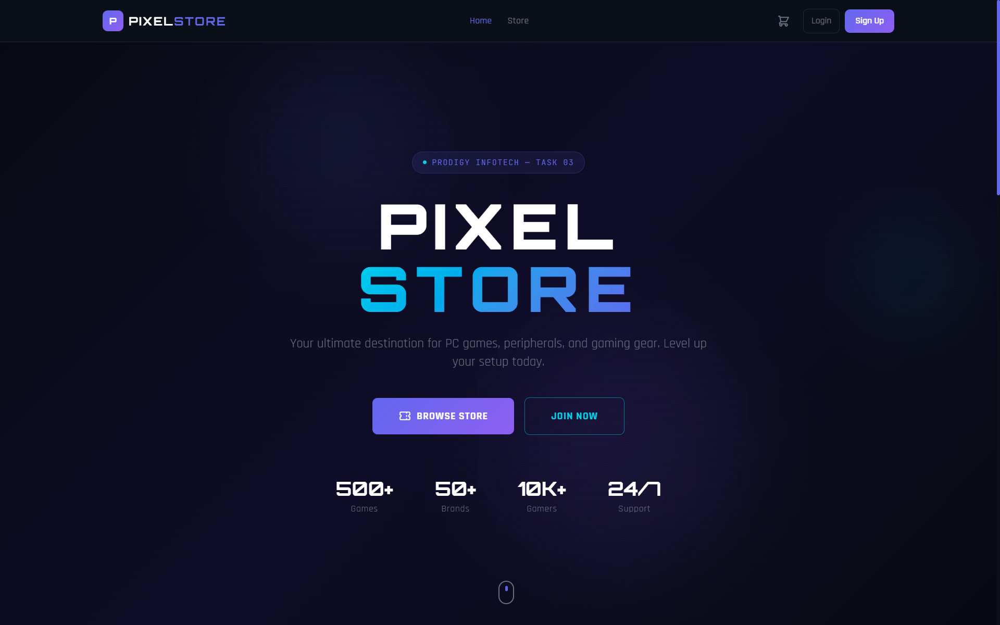
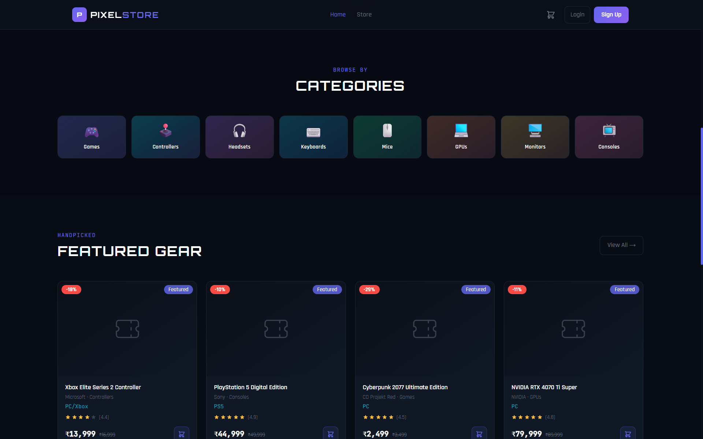
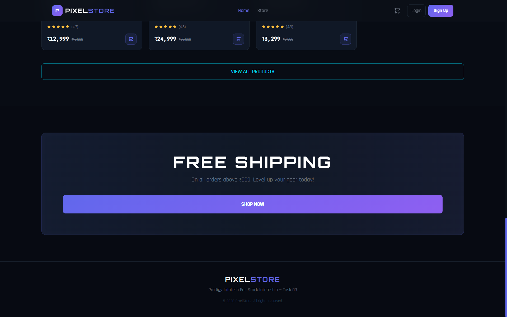
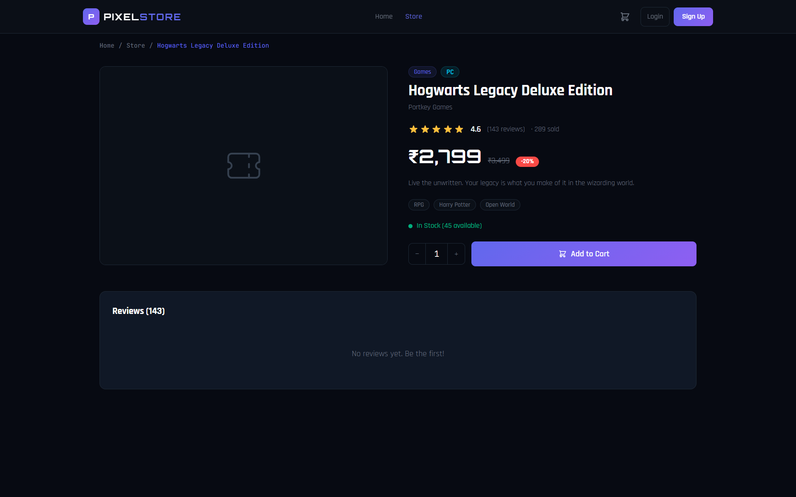
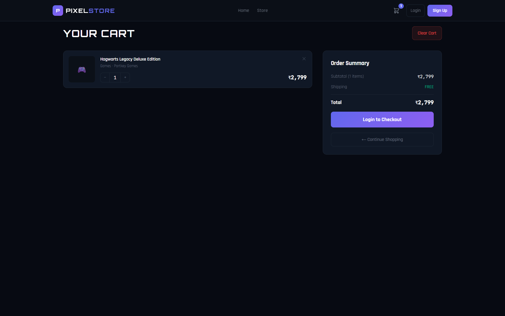
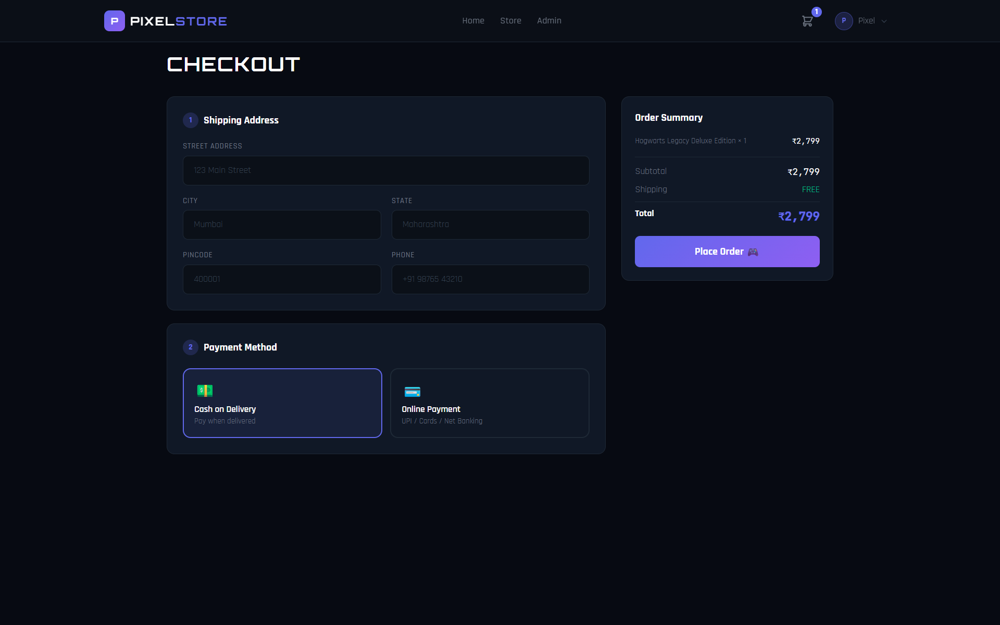
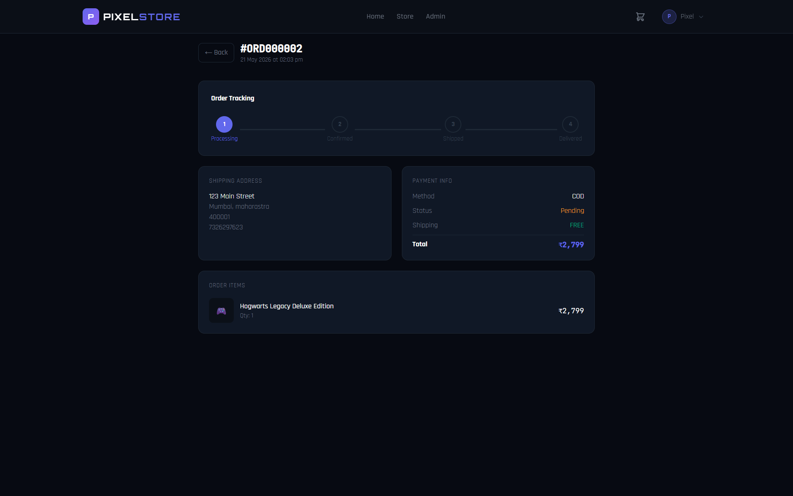
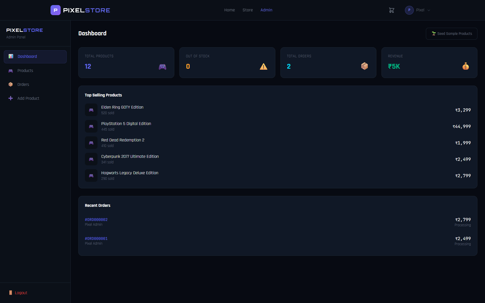

# 🎮 PixelStore — PC Gaming E-Commerce Platform

> **Prodigy Infotech Full Stack Internship — Task 03**

A full-stack e-commerce platform for a PC Gaming store built with React, Node.js, Express, MongoDB, and JWT. Features product listings, shopping cart, order tracking, admin dashboard, and more.

---

## 📸 Screenshots

### Home Page




### Store / Products


### Product Details


### Shopping Cart


### Checkout


### Order Tracking


### Admin Dashboard


---

## ✨ Features

### User Features
- ✅ User Registration & Login with JWT
- ✅ Browse products with search, filter & sort
- ✅ Filter by category, price range
- ✅ Sort by newest, price, rating, popularity
- ✅ Product details with reviews & ratings
- ✅ Add to Cart / Remove from Cart
- ✅ Cart quantity management
- ✅ Checkout with shipping address
- ✅ Cash on Delivery & Online Payment
- ✅ Order placement & order history
- ✅ Order tracking with status steps
- ✅ User profile with address management
- ✅ Wishlist functionality
- ✅ Write product reviews

### Admin Features
- ✅ Admin dashboard with stats & charts
- ✅ Add / Edit / Delete products
- ✅ Image upload with Multer
- ✅ Manage all orders
- ✅ Update order status
- ✅ Seed sample products (12 gaming products)
- ✅ Top selling products overview
- ✅ Revenue tracking

---

## 🛠 Tech Stack

| Layer       | Tech                          |
|-------------|-------------------------------|
| Frontend    | React 18 + Vite               |
| Styling     | Tailwind CSS                  |
| Routing     | React Router DOM v6           |
| State       | Context API                   |
| HTTP Client | Axios                         |
| Backend     | Node.js + Express.js          |
| Database    | MongoDB Atlas + Mongoose      |
| Auth        | JWT + bcryptjs                |
| Upload      | Multer (local storage)        |

---

## 📁 Project Structure

```
PRODIGY_FS_03/
├── client/                        # React + Vite Frontend
│   └── src/
│       ├── components/
│       │   ├── common/            # ProductCard, ProtectedRoute
│       │   └── layout/            # Navbar
│       ├── context/               # AuthContext, CartContext
│       ├── pages/                 # All pages
│       │   ├── Home.jsx
│       │   ├── Auth.jsx           # Login + Register
│       │   ├── Products.jsx
│       │   ├── ProductDetails.jsx
│       │   ├── Cart.jsx
│       │   ├── Checkout.jsx
│       │   ├── Orders.jsx
│       │   ├── Profile.jsx
│       │   ├── Admin.jsx
│       │   └── NotFound.jsx
│       ├── utils/api.js           # Axios instance
│       ├── App.jsx
│       └── index.css
│
├── server/                        # Node.js + Express Backend
│   ├── config/db.js
│   ├── controllers/
│   │   ├── authController.js
│   │   ├── productController.js
│   │   ├── orderController.js
│   │   └── wishlistController.js
│   ├── middleware/
│   │   ├── auth.js
│   │   └── upload.js
│   ├── models/
│   │   ├── User.js
│   │   ├── Product.js
│   │   └── Order.js
│   ├── routes/
│   │   ├── authRoutes.js
│   │   ├── productRoutes.js
│   │   ├── orderRoutes.js
│   │   └── wishlistRoutes.js
│   ├── uploads/                   # Product images stored here
│   ├── index.js
│   └── .env.example
│
├── screenshots/                   # Project screenshots
├── .gitignore
├── package.json
└── README.md
```

---

## 🚀 Installation & Setup

### Prerequisites
- Node.js v18+
- MongoDB Atlas account (free tier)
- Git

### 1. Clone the Repository
```bash
git clone https://github.com/SiddharthBhat120/PRODIGY_FS_03.git
cd PRODIGY_FS_03
```

### 2. Configure Environment Variables
```bash
cd server
cp .env.example .env
```

Edit `server/.env`:
```env
PORT=5000
MONGO_URI=mongodb+srv://<username>:<password>@cluster0.xxxxx.mongodb.net/prodigy_gamestore?retryWrites=true&w=majority
JWT_SECRET=your_super_secret_key_here
JWT_EXPIRE=7d
CLIENT_URL=http://localhost:5173
```

### 3. Install Dependencies
```bash
# Backend
cd server
npm install

# Frontend
cd ../client
npm install
```

### 4. Run the Project

**Terminal 1 — Backend:**
```bash
cd server
npm run dev
```

**Terminal 2 — Frontend:**
```bash
cd client
npm run dev
```

### 5. Open in Browser
```
http://localhost:5173
```

---

## 🌱 Initial Data Setup

### Step 1 — Create Admin Account
- Go to `http://localhost:5173/login`
- Click **"Seed Admin"** button
- Login with: `admin@pixelstore.com` / `admin123`

### Step 2 — Seed Sample Products
- Login as admin
- Go to **Admin Panel → Dashboard**
- Click **"Seed Sample Products"** button
- This loads 12 gaming products automatically

---

## 🌐 API Reference

### Auth Routes
| Method | Route | Access | Description |
|--------|-------|--------|-------------|
| POST | /api/auth/register | Public | Register user |
| POST | /api/auth/login | Public | Login user |
| POST | /api/auth/seed-admin | Public | Create default admin |
| GET | /api/auth/profile | Private | Get profile |
| PUT | /api/auth/profile | Private | Update profile |

### Product Routes
| Method | Route | Access | Description |
|--------|-------|--------|-------------|
| GET | /api/products | Public | Get all products (search/filter/sort) |
| GET | /api/products/:id | Public | Get single product |
| POST | /api/products | Admin | Create product |
| PUT | /api/products/:id | Admin | Update product |
| DELETE | /api/products/:id | Admin | Delete product |
| POST | /api/products/:id/review | Private | Add review |
| POST | /api/products/seed | Admin | Seed sample products |

### Order Routes
| Method | Route | Access | Description |
|--------|-------|--------|-------------|
| POST | /api/orders | Private | Place order |
| GET | /api/orders/my | Private | My orders |
| GET | /api/orders/:id | Private | Order details |
| GET | /api/orders/admin/all | Admin | All orders |
| PUT | /api/orders/:id/status | Admin | Update status |

### Wishlist Routes
| Method | Route | Access | Description |
|--------|-------|--------|-------------|
| GET | /api/wishlist | Private | Get wishlist |
| POST | /api/wishlist/toggle/:id | Private | Toggle wishlist |

---

## 🍃 MongoDB Atlas Setup

1. Go to [cloud.mongodb.com](https://cloud.mongodb.com)
2. Create a free **M0 cluster**
3. Click **Connect** → **Drivers** → copy connection string
4. Go to **Network Access** → **Add IP Address** → **Allow Access from Anywhere**
5. Paste connection string in `server/.env` as `MONGO_URI`

---

## ☁️ Deployment

### Frontend → Vercel
1. Go to [vercel.com](https://vercel.com) → New Project
2. Import your GitHub repo
3. Set **Root Directory** to `client`
4. Build Command: `npm run build`
5. Output Directory: `dist`
6. Deploy!

### Backend → Render
1. Go to [render.com](https://render.com) → New Web Service
2. Connect GitHub repo
3. **Root Directory**: `server`
4. **Build Command**: `npm install`
5. **Start Command**: `node index.js`
6. Add all environment variables from `.env`
7. Deploy!

---

## 📤 GitHub Push Commands

```bash
git init
git add .
git commit -m "feat: Prodigy FS Task 03 - Local Store E-Commerce Platform"
git branch -M main
git remote add origin https://github.com/SiddharthBhat120/PRODIGY_FS_03.git
git push -u origin main
```

---

## 🎮 Product Categories

The store includes products in these categories:
- 🎮 **Games** — PC titles like Cyberpunk 2077, Elden Ring, RDR2
- 🕹️ **Controllers** — Xbox Elite, PS5 DualSense
- 🎧 **Headsets** — SteelSeries, Razer, HyperX
- ⌨️ **Keyboards** — Mechanical gaming keyboards
- 🖱️ **Mice** — Lightweight gaming mice
- 🖥️ **Monitors** — High refresh rate gaming monitors
- 💻 **GPUs** — NVIDIA RTX series
- 📺 **Consoles** — PlayStation 5, Xbox Series X

---

## 👤 Author

**Siddharth Bhat**
Prodigy Infotech Full Stack Internship
GitHub: [@SiddharthBhat120](https://github.com/SiddharthBhat120)

---

## 📄 License

MIT License — built for learning and internship purposes.
